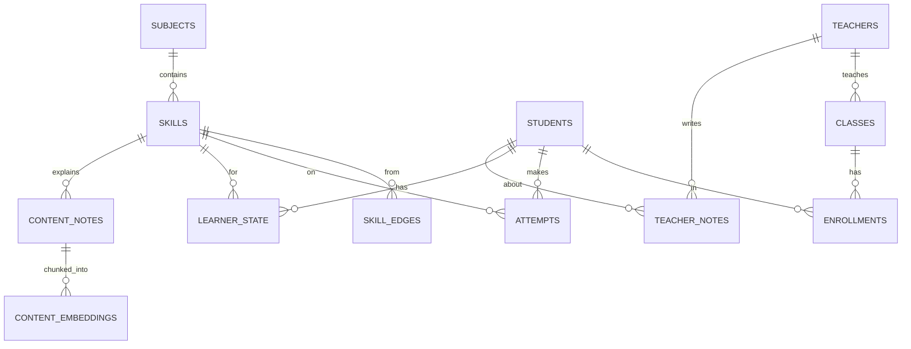

# 03 — Database: Schema & Migrationen (E2, M1)

**Ziel:** Vollständiges Schema für alle drei Retrieval-Modi aus *einer* Datenbank, plus der
Session-Hook, der später RLS speist.

**Voraussetzungen:** FND-3 (Postgres+pgvector), FND-2 (uv/Alembic).
**Issues:** DB-1 … DB-4.

---

## 1. Entitäten (Überblick)

| Tabelle | Zweck | Modus-Bezug |
|---|---|---|
| `students` | Lernende (PII minimal) | individual |
| `teachers` | Lehrpersonen | — |
| `classes` | Klassen/Kurse | population |
| `enrollments` | Schüler↔Klasse (Kohorten-Zugehörigkeit) | population |
| `subjects` | Fächer (Mathe, Sprache, …) | grading-Key |
| `skills` | Lernziele/Skills pro Fach | alle |
| `skill_edges` | Voraussetzungs-/Link-Graph zwischen Skills | graph |
| `content_notes` | Markdown-Notizen (Prosa) | semantic |
| `content_embeddings` | `pgvector`-Embedding pro Chunk + Sidecar-Query | semantic |
| `attempts` | einzelne Antwortversuche | individual/population |
| `learner_state` | Mastery pro (student, skill) inkl. Unsicherheit | individual |
| `teacher_notes` | Notizen/Interventionen der Lehrperson | individual |

> **PII-Minimierung (P4):** `students` enthält nur, was nötig ist. Kein Freitext-Profil.
> Alles Identifizierende bleibt in der DB und wird nie roh an ein externes LLM gegeben.

---

## 2. ER-Diagramm (Mermaid)



---

## 3. Schema (DDL, Referenz)

`infra/init` ist nur für Extensions; **Tabellen kommen aus Alembic** (DB-1). DDL zur Orientierung:

```sql
CREATE TABLE students (
  id           uuid PRIMARY KEY DEFAULT uuid_generate_v4(),
  display_name text NOT NULL,              -- Anzeigename, kein Klartext an LLM
  grade_level  int  NOT NULL,              -- Stufe
  created_at   timestamptz NOT NULL DEFAULT now()
);

CREATE TABLE teachers (
  id           uuid PRIMARY KEY DEFAULT uuid_generate_v4(),
  display_name text NOT NULL
);

CREATE TABLE classes (
  id          uuid PRIMARY KEY DEFAULT uuid_generate_v4(),
  name        text NOT NULL,
  teacher_id  uuid REFERENCES teachers(id)
);

CREATE TABLE enrollments (
  student_id uuid REFERENCES students(id) ON DELETE CASCADE,
  class_id   uuid REFERENCES classes(id)  ON DELETE CASCADE,
  PRIMARY KEY (student_id, class_id)
);

CREATE TABLE subjects (
  id   uuid PRIMARY KEY DEFAULT uuid_generate_v4(),
  key  text UNIQUE NOT NULL,               -- 'math' | 'language' | 'history' (Grading-Key, P7)
  name text NOT NULL
);

CREATE TABLE skills (
  id          uuid PRIMARY KEY DEFAULT uuid_generate_v4(),
  subject_id  uuid REFERENCES subjects(id),
  key         text NOT NULL,               -- z.B. 'complete-the-square'
  name        text NOT NULL,
  grade_level int  NOT NULL,
  UNIQUE (subject_id, key)
);

CREATE TABLE skill_edges (                 -- gerichteter Voraussetzungs-/Link-Graph
  from_skill uuid REFERENCES skills(id) ON DELETE CASCADE,
  to_skill   uuid REFERENCES skills(id) ON DELETE CASCADE,
  kind       text NOT NULL DEFAULT 'prerequisite',  -- prerequisite | related
  PRIMARY KEY (from_skill, to_skill, kind)
);

CREATE TABLE content_notes (
  id         uuid PRIMARY KEY DEFAULT uuid_generate_v4(),
  skill_id   uuid REFERENCES skills(id),
  source_path text NOT NULL,               -- Pfad im Vault
  prose      text NOT NULL,                -- Prosa OHNE Codeblöcke
  created_at timestamptz NOT NULL DEFAULT now()
);

CREATE TABLE content_embeddings (
  id         uuid PRIMARY KEY DEFAULT uuid_generate_v4(),
  note_id    uuid REFERENCES content_notes(id) ON DELETE CASCADE,
  chunk      text NOT NULL,
  embedding  vector(1024) NOT NULL,        -- Dim an Modell anpassen
  sidecar_query text                       -- abgetrennter ```sql-Block (P-Ingestion)
);
CREATE INDEX ON content_embeddings USING hnsw (embedding vector_cosine_ops);

CREATE TABLE attempts (
  id          uuid PRIMARY KEY DEFAULT uuid_generate_v4(),
  student_id  uuid NOT NULL REFERENCES students(id) ON DELETE CASCADE,
  skill_id    uuid NOT NULL REFERENCES skills(id),
  item_ref    text NOT NULL,               -- Referenz auf Aufgabe
  is_correct  boolean NOT NULL,
  raw_answer  text,
  created_at  timestamptz NOT NULL DEFAULT now()
);
CREATE INDEX ON attempts (student_id, skill_id, created_at);

CREATE TABLE learner_state (
  student_id  uuid NOT NULL REFERENCES students(id) ON DELETE CASCADE,
  skill_id    uuid NOT NULL REFERENCES skills(id),
  mastery     double precision NOT NULL DEFAULT 0.0,  -- P(known)
  uncertainty double precision NOT NULL DEFAULT 1.0,  -- für Open Learner Model (P5)
  attempts_count int NOT NULL DEFAULT 0,
  updated_at  timestamptz NOT NULL DEFAULT now(),
  PRIMARY KEY (student_id, skill_id)
);

CREATE TABLE teacher_notes (
  id          uuid PRIMARY KEY DEFAULT uuid_generate_v4(),
  student_id  uuid NOT NULL REFERENCES students(id) ON DELETE CASCADE,
  teacher_id  uuid NOT NULL REFERENCES teachers(id),
  skill_id    uuid REFERENCES skills(id),
  body        text NOT NULL,
  override_mastery double precision,        -- optionaler Lehrer-Override (P6)
  created_at  timestamptz NOT NULL DEFAULT now()
);
```

---

## 4. SQLAlchemy-Modelle (DB-2)

`apps/api/src/its/db/models.py` (Auszug — Muster für alle Tabellen):

```python
import uuid
from datetime import datetime
from sqlalchemy import ForeignKey, String, Boolean, Integer, Float, Text, DateTime, func
from sqlalchemy.dialects.postgresql import UUID
from sqlalchemy.orm import DeclarativeBase, Mapped, mapped_column, relationship
from pgvector.sqlalchemy import Vector

class Base(DeclarativeBase):
    pass

class Student(Base):
    __tablename__ = "students"
    id: Mapped[uuid.UUID] = mapped_column(UUID(as_uuid=True), primary_key=True, default=uuid.uuid4)
    display_name: Mapped[str] = mapped_column(String, nullable=False)
    grade_level: Mapped[int] = mapped_column(Integer, nullable=False)
    created_at: Mapped[datetime] = mapped_column(DateTime(timezone=True), server_default=func.now())

class Attempt(Base):
    __tablename__ = "attempts"
    id: Mapped[uuid.UUID] = mapped_column(UUID(as_uuid=True), primary_key=True, default=uuid.uuid4)
    student_id: Mapped[uuid.UUID] = mapped_column(ForeignKey("students.id", ondelete="CASCADE"))
    skill_id: Mapped[uuid.UUID] = mapped_column(ForeignKey("skills.id"))
    item_ref: Mapped[str] = mapped_column(String, nullable=False)
    is_correct: Mapped[bool] = mapped_column(Boolean, nullable=False)
    raw_answer: Mapped[str | None] = mapped_column(Text)
    created_at: Mapped[datetime] = mapped_column(DateTime(timezone=True), server_default=func.now())

class LearnerState(Base):
    __tablename__ = "learner_state"
    student_id: Mapped[uuid.UUID] = mapped_column(ForeignKey("students.id", ondelete="CASCADE"), primary_key=True)
    skill_id: Mapped[uuid.UUID] = mapped_column(ForeignKey("skills.id"), primary_key=True)
    mastery: Mapped[float] = mapped_column(Float, default=0.0)
    uncertainty: Mapped[float] = mapped_column(Float, default=1.0)
    attempts_count: Mapped[int] = mapped_column(Integer, default=0)
    updated_at: Mapped[datetime] = mapped_column(DateTime(timezone=True), server_default=func.now())

class ContentEmbedding(Base):
    __tablename__ = "content_embeddings"
    id: Mapped[uuid.UUID] = mapped_column(UUID(as_uuid=True), primary_key=True, default=uuid.uuid4)
    note_id: Mapped[uuid.UUID] = mapped_column(ForeignKey("content_notes.id", ondelete="CASCADE"))
    chunk: Mapped[str] = mapped_column(Text, nullable=False)
    embedding: Mapped[list[float]] = mapped_column(Vector(1024), nullable=False)
    sidecar_query: Mapped[str | None] = mapped_column(Text)
```

> Restliche Modelle (`Teacher`, `Class`, `Enrollment`, `Subject`, `Skill`, `SkillEdge`,
> `ContentNote`, `TeacherNote`) nach demselben Muster.

---

## 5. Session-/Engine-Setup mit Rollen-Hook (DB-3) · `safety-critical`

> Dieser Hook ist die **Brücke zu RLS** (04). Pro Request wird die Postgres-Rolle gesetzt und
> bei Schüler:innen die `student_id` als Session-Variable hinterlegt, auf die die RLS-Policy
> zugreift. Fail-closed: ohne gesetzten Kontext keine Schüler-Daten.

`apps/api/src/its/db/session.py`:

```python
from collections.abc import Iterator
from contextlib import contextmanager
from sqlalchemy import create_engine, text
from sqlalchemy.orm import Session, sessionmaker
from its.config import settings
from its.auth.deps import Principal
from its.auth.roles import PG_ROLE, Role

engine = create_engine(settings.database_url, pool_pre_ping=True)
SessionLocal = sessionmaker(bind=engine, expire_on_commit=False)

@contextmanager
def scoped_session(principal: Principal) -> Iterator[Session]:
    """Öffnet eine Session und setzt Rolle + (für Schüler) student_id-Kontext.
    Diese Variablen werden von den RLS-Policies in rls.sql gelesen (docs/04)."""
    session = SessionLocal()
    try:
        pg_role = PG_ROLE[principal.role]
        session.execute(text("SET ROLE :r").bindparams(r=pg_role))
        if principal.role == Role.STUDENT:
            if not principal.student_id:
                raise PermissionError("student principal without student_id (fail-closed)")
            session.execute(
                text("SET app.current_student_id = :sid").bindparams(sid=principal.student_id)
            )
        yield session
        session.commit()
    except Exception:
        session.rollback()
        raise
    finally:
        session.execute(text("RESET ROLE"))
        session.close()
```

**AK:** `scoped_session(principal)` setzt Rolle/Kontext; ein Schüler-Principal ohne
`student_id` führt zu `PermissionError` (fail-closed).

---

## 6. Migrationen (DB-1) & Skill-Seed (DB-4)

- Alembic in `apps/api` initialisieren (`uv run alembic init -t async ...` bzw. sync); `env.py`
  liest `settings.database_url` und `Base.metadata`.
- **DB-1:** eine Migration `0001_core_schema` erstellt alle Tabellen + Indizes inkl. HNSW.
- **DB-4:** Daten-Migration/Seed legt Fach `math`, ein paar Skills und `skill_edges` an
  (z. B. `linear-equations → complete-the-square → quadratic-formula`). Klein halten; echte
  Mengen kommen über den Seeder (docs/11).

---

## 7. Akzeptanzkriterien

- [ ] Migration `0001_core_schema` erstellt alle Tabellen + HNSW-Index (DB-1)
- [ ] `models.py` deckt alle Tabellen typisiert ab; `pgvector`-Spalte funktioniert (DB-2)
- [ ] `scoped_session` setzt Rolle + `app.current_student_id`; fail-closed ohne `student_id` (DB-3)
- [ ] Demo-Skill-Graph vorhanden (DB-4)

---

## Claude-Code-Prompt

```
Setze E2 (docs/03-database.md) um: Alembic einrichten, Migration 0001_core_schema für alle
Tabellen inkl. pgvector HNSW-Index, vollständige SQLAlchemy-Modelle in db/models.py,
db/session.py mit scoped_session (Rollen-/student_id-Hook, fail-closed), und einen kleinen
Mathe-Skill-Graph-Seed (DB-4). Migration gegen die Docker-DB ausführen und mit einem kurzen
Smoke-Skript prüfen, dass Tabellen existieren. Beachte P4 (PII-Minimierung). Schliesse DB-1..4.
```
